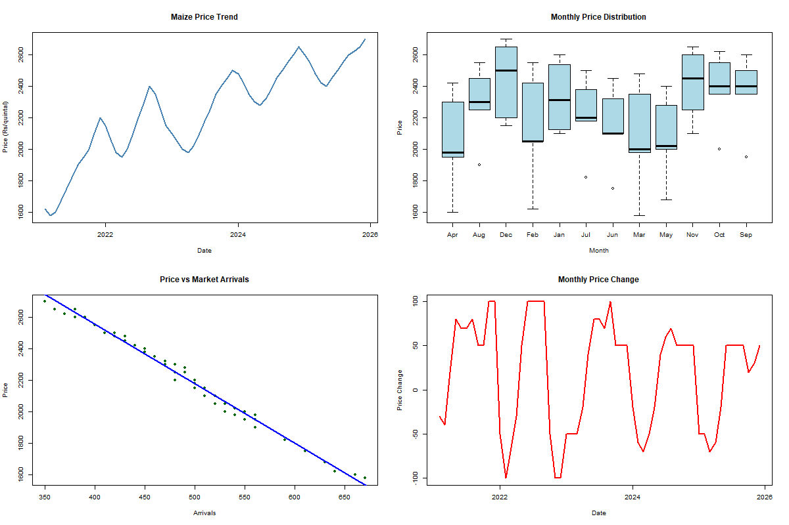

# Agricultural Market Dashboard – Maize Price Analysis

## Dashboard Preview



---

## Project Goal

The goal of this project is to demonstrate how agricultural market data can be analyzed and summarized using **R** to generate insights about **price trends, seasonal patterns, supply effects, and market volatility**.

This dashboard combines multiple analyses into a **single visual report**, similar to how analysts present insights to decision-makers.

---

## Project Overview

This project builds a **market analysis dashboard** using maize price and arrival data.

The dashboard summarizes key aspects of agricultural markets including:

* long-term price trends
* seasonal price behavior
* the relationship between supply and price
* short-term price fluctuations

By combining multiple visualizations into one layout, the dashboard provides a **quick overview of market behavior**.

---

## Dataset

The dataset contains historical maize market observations.

| Column   | Description                        |
| -------- | ---------------------------------- |
| date     | Date of observation                |
| price    | Maize market price (₹ per quintal) |
| arrivals | Market arrivals (supply volume)    |

The dataset includes **monthly observations across several years**, allowing meaningful trend and pattern analysis.

---

## Tools Used

* **R**
* **RStudio**
* **ggplot2** – data visualization
* **dplyr** – data manipulation
* **Base R plotting** – dashboard layout

---

## Project Structure

```
agri-market-dashboard
│
├── maize_price_arrivals_dashboard.csv
├── market_dashboard.R
├── agri_market_dashboard.png
└── README.md
```

---

## Dashboard Components

The dashboard contains four analytical panels.

### 1. Price Trend

Shows how maize prices evolve over time and highlights the long-term market trend.

### 2. Monthly Price Distribution

Displays the distribution of maize prices across months to identify seasonal behavior.

### 3. Price vs Market Arrivals

Explores the relationship between market supply and price using a regression trend line.

### 4. Monthly Price Change

Visualizes short-term price fluctuations to highlight market volatility.

---

## Methodology

The analysis followed these steps:

1. Load maize market data
2. Convert date variables into time format
3. Calculate monthly price changes
4. Explore relationships between price and arrivals
5. Generate visualizations for trend, distribution, correlation, and volatility
6. Combine the visualizations into a **single dashboard layout**

---

## Key Takeaways

* Maize prices show a **gradual upward trend** over the observed period.
* Seasonal patterns suggest **variation in prices across months**.
* Higher market arrivals are associated with **lower maize prices**, reflecting supply effects.
* Monthly price changes highlight **periods of higher market volatility**.

---

## How to Run the Project

1. Clone this repository
2. Open the project in **RStudio**

Install required packages:

```r
install.packages("ggplot2")
install.packages("dplyr")
```

Run the script:

```
market_dashboard.R
```

The script will generate the dashboard image:

```
agri_market_dashboard.png
```

---

## Author

**Kiran Jala**
MBA Agribusiness Management

Interest areas:
Agricultural market analysis, commodity price forecasting, and data analytics.
